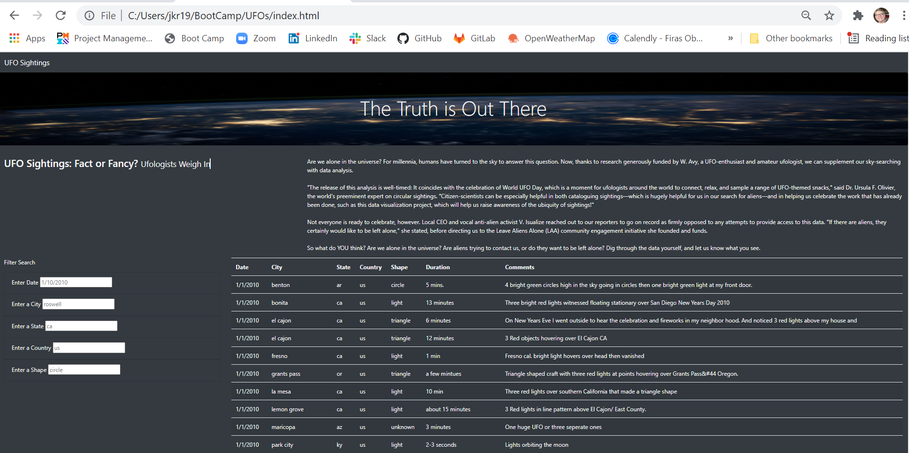
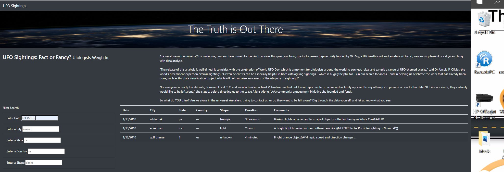
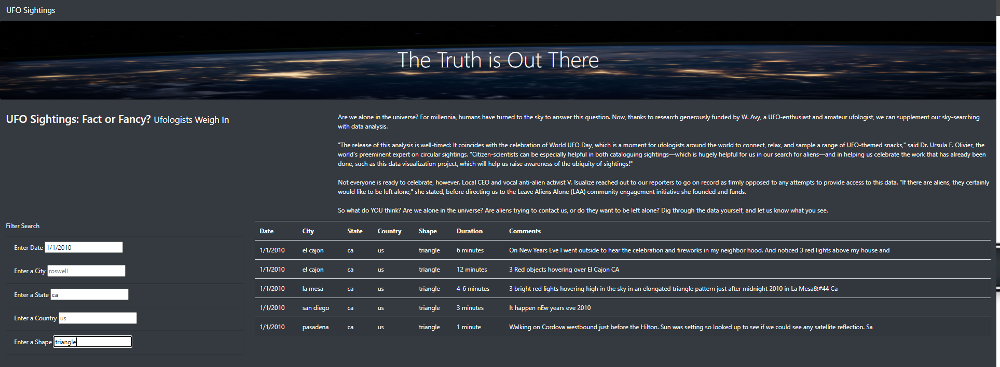

# UFO Sightings
## Overview
Dana is a Data Journalist who wants to write about McMinnville, Oregon, which is famous for UFO sightings and has an annual gathering celebrating such. McMinnville is her hometown and this opportunity allows her to revisit memories as well as to focus on a topic she has been interested in since she was a child - UFO sightings.  
## Purpose
Dana only has a Javascript file filled with sighting information in many countries, cities, and states.  She wants to create a HTML page that includes her article, a table with filters which allows searching and displaying the sightings information. She knows that she can use Javascript to manipulate the data so readers can easily use her website.  
## Resources
Software(s): HTML, CSS, Chrome Developer Tools, Bootstrap 3.3.3, and Visual Studio Code 1.57.1
## Results
We have included the steps and related images to describe the process of using the search criteria.<br/>

1)  When users open the webpage, they will see an introduction and a sightings contained in a table that allows them to filter the table for their search criteria:<br/>

<br/>

2)  The user can enter their search criteria in one or more fields that are prefilled with placeholders to show the format of the input.  The following image has only one (date) filter.<br/> 

<br/>

The image below shows multiple filters.<br/>

<br/>

3)  The user must click on the title "UFO Sightings" in the upper left hand corner to refresh or reset the table.

## Summary

We noticed one drawback as we were testing your website:  There are no parameters to inform a user of the limitation of the data or that they have queried for something that is not included, such as a date or state.

Following are two recommendations for further development:

1) One recommendation for future development would be change the input fields to dropdown fields in answer to our mentioned drawback above.

2) Another recommendation for future development would be to add one or more buttons to clearly direct the user how to interact with the data.  Below is a sample of code that could be inserted into the index.html file:

```<button id="filter-btn" type="button" class="btn btn-dark">Filter Table</button>```<br/>
```<button id="reset-btn" type="button" class="btn btn-default">```

